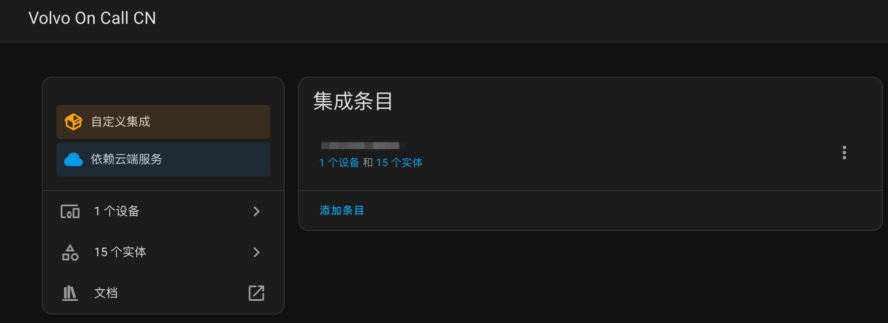
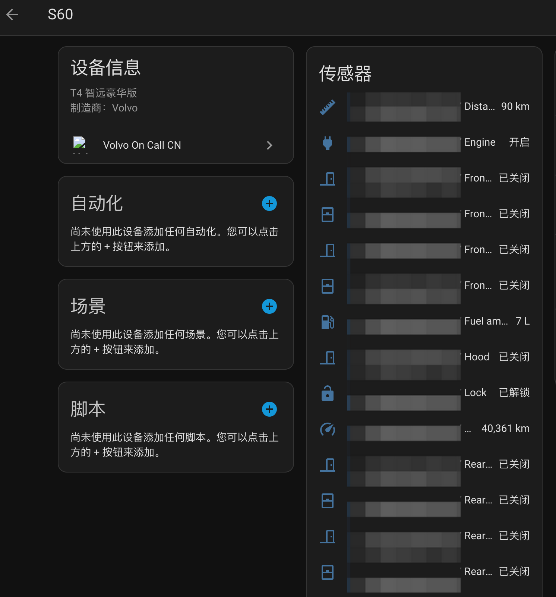

# Volvo On Call CN
Homeassistant volvooncall 中国区插件

# 主要功能
1. 各传感器状态（门、锁、窗、发动机、油箱、里程数）

# HACS 安装集成
HACS -> 集成 -> 右上角三个点 -> 自定义存储库
- 存储库：https://github.com/idreamshen/hass-volvooncall-cn
- 类别：集成

浏览并下载存储库 -> 搜索 Volvo On Call CN 并下载

# Homeassistant 添加集成
设置 -> 设备与服务 -> 添加集成 -> 搜索品牌 Volvo On Call CN -> 填入手机号和密码
- 手机号：11 位纯数字
- 密码：即“沃尔沃APP”上的登录密码，需要提前设置好登录密码

提交稍等片刻后，即可看到拥有的车辆设备

# 效果预览

